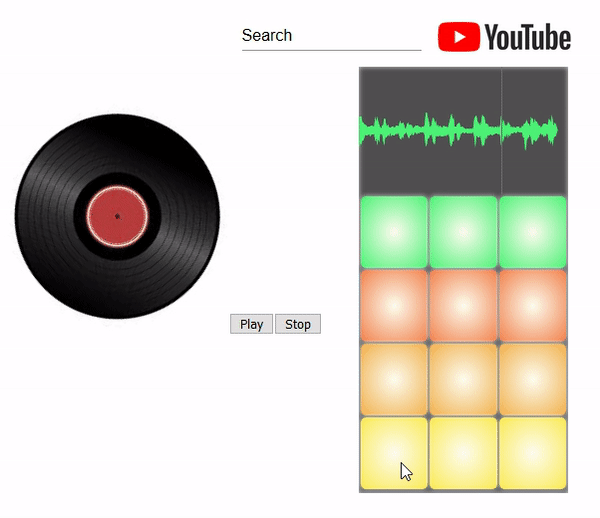

# Close encounter

> An online powerful launchpad project

## What is it about

The goal here is to provide a simple online launchpad. In the end, it will allow you to load your own sounds, search sounds form internet sources such as YouTube and Soundcloud and sample these sounds. We will also allow you to connect a MIDI device to control the online interface!

## How to use

This project is hosted on [Github Pages](https://ifly79.github.io/close-encounters/). Simply navigate here and start messing around.

### Features

- [x] Play sounds on the launchpad board.

### Coming soon

- [ ] Find sound on online services (see [issue #5](https://github.com/IFly79/close-encounters/issues/5))
- [ ] Upload your own sounds (see [issue #7](https://github.com/IFly79/close-encounters/issues/7))
- [ ] Display the waveform of the audio (see [issue #6](https://github.com/IFly79/close-encounters/issues/6))
- [ ] Pilot a MIDI device (see [issue #8](https://github.com/IFly79/close-encounters/issues/8))

## How to contribute

Read [CONTRIBUTING.md](https://github.com/lightning-buzz/launchpad/blob/master/CONTRIBUTING.md)
